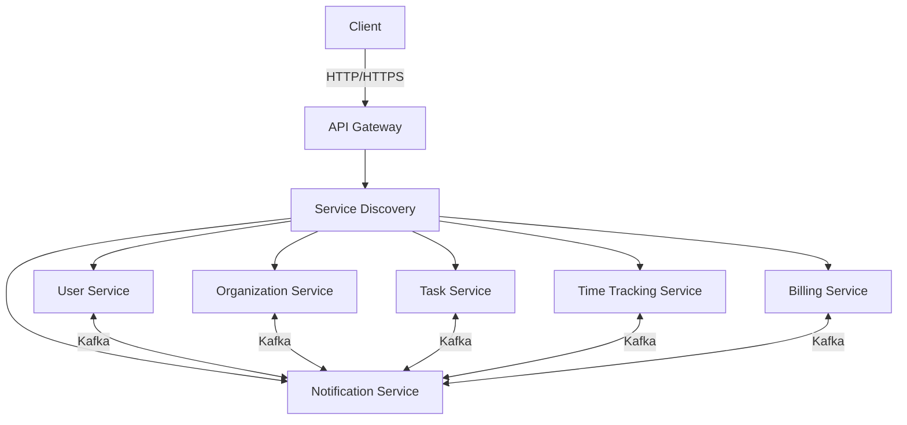

<div align="center">
  <h1>WorkStreamERP</h1>
  <h3>Enterprise Resource Planning for the Modern Remote Workforce</h3>
  
  <p align="center">
    
    
    
    
  </p>
  
  <p align="center">
    <a href="#-features">Features</a> •
    <a href="#-tech-stack">Tech Stack</a> •
    <a href="#-architecture">Architecture</a> •
    <a href="#-getting-started">Getting Started</a> •
    <a href="#-contributing">Contributing</a>
  </p>
</div>

<div align="center">
  
  
  
  
  
  
</div>

## 📝 Overview

WorkStreamERP is a modern, microservices-based Enterprise Resource Planning (ERP) system designed specifically for remote teams and freelancers. It streamlines project management, time tracking, and financial operations in one unified platform.

> **Note:** 🚧 This project is currently in active development. We're working hard to bring you a robust ERP solution. Contributions are welcome!

## ✨ Features

### 🔐 Authentication & Security
- 🔑 JWT-based authentication
- 🛡️ Role-based access control (RBAC)
- 🔒 Secure API endpoints with Spring Security
- 🔄 OAuth 2.0 and OpenID Connect support

### 🏢 Organization Management
- 👥 Team and user management
- 🏛️ Multi-tenant architecture
- 🔄 Real-time collaboration
- 📊 Organization analytics

### 📊 Project Management
- 📝 Task management with priorities and deadlines
- 📈 Project progress tracking
- 🗂️ File sharing and document management
- 🏷️ Custom labels and tags

### ⏱ Time Tracking
- ⏱️ Real-time time tracking
- 📑 Timesheet generation
- 📊 Productivity analytics
- ⏰ Automated reminders

### 💰 Financial Management
- 💳 Auto-generated invoices
- 💸 Payment tracking
- 📊 Financial reporting
- 💱 Multi-currency support

## 🏗 System Architecture



## 🛠 Tech Stack

| Category       | Technologies                                                                 |
|----------------|-----------------------------------------------------------------------------|
| **Backend**    | Java 17, Spring Boot 3.1.0, Spring Security, JWT, JPA, Hibernate           |
| **Database**   | PostgreSQL 14, Redis 7 (Caching)                                           |
| **Messaging**  | Apache Kafka 3.3                                                           |
| **DevOps**     | Docker, Docker Compose, GitHub Actions, Maven                              |
| **Frontend**   | (Future) React.js, Redux, Material-UI                                      |
| **Monitoring** | (Future) Prometheus, Grafana, ELK Stack                                    |

## 🚀 Getting Started

### Prerequisites

- Java 17 or higher
- Maven 3.8+
- Docker and Docker Compose
- PostgreSQL 14+
- Kafka 3.3+
- Redis 7+

### Quick Start

1. **Clone the repository**
   ```bash
   git clone https://github.com/porfskylord/WorkStreamERP.git
   cd WorkStreamERP
   ```

2. **Start the infrastructure**
   ```bash
   docker-compose up -d
   ```

3. **Build and run services**
   ```bash
   mvn clean install
   # Start individual services from their directories
   ```

## 📚 API Documentation

Once the services are running, you can access the API documentation:

- **API Gateway Swagger UI**: http://localhost:8080/swagger-ui.html
- **Individual service docs**: http://localhost:<service-port>/swagger-ui.html

## 🏗 Project Structure

```
WorkStreamERP/
├── api-gateway/          # API Gateway service
├── auth-service/         # Authentication service
├── user-service/         # User management
├── organization-service/ # Organization management
├── invite-service/       # Invitation system
├── notification-service/ # Real-time notifications
├── org-members-service/  # Organization members management
├── commo/                # Common utilities and DTOs
└── discovery-server/     # Service discovery
```

## 🤝 Contributing

We welcome contributions from the community! Here's how you can help:

1. Fork the repository
2. Create your feature branch: `git checkout -b feature/amazing-feature`
3. Commit your changes: `git commit -m 'Add some amazing feature'`
4. Push to the branch: `git push origin feature/amazing-feature`
5. Open a Pull Request

### Code Style

This project follows the [Google Java Style Guide](https://google.github.io/styleguide/javaguide.html). Please ensure your code adheres to these standards before submitting pull requests.

## 📄 License

This project is licensed under the MIT License - see the [LICENSE](LICENSE) file for details.

## 📞 Contact

- **Project Link**: [https://github.com/porfskylord/WorkStreamERP](https://github.com/porfskylord/WorkStreamERP)
- **Issues**: [GitHub Issues](https://github.com/porfskylord/WorkStreamERP/issues)

## 🙏 Acknowledgments

This project stands on the shoulders of these amazing open-source projects:

- [Spring Boot](https://spring.io/projects/spring-boot) - For building production-ready applications
- [Spring Cloud](https://spring.io/projects/spring-cloud) - For cloud-native patterns
- [Kafka](https://kafka.apache.org/) - For event streaming and message queuing
- [PostgreSQL](https://www.postgresql.org/) - Our reliable database
- [Redis](https://redis.io/) - For caching and real-time features
- [Docker](https://www.docker.com/) - For containerization

<div align="center">
  <p>Made with ❤️ by the WorkStreamERP Team</p>
  <p>If you like this project, please give it a ⭐ on <a href="https://github.com/porfskylord/WorkStreamERP">GitHub</a></p>
</div>

- **Backend**: Java 17, Spring Boot, Spring Security
- **Database**: PostgreSQL, Redis (Caching)
- **Messaging**: Apache Kafka
- **Authentication**: JWT (JSON Web Tokens)
- **Containerization**: Docker
- **CI/CD**: GitHub Actions
- **API**: RESTful APIs

## 🌟 Key Features

### 🔐 Authentication & Authorization
- JWT-based authentication
- Role-based access control (RBAC)
- Secure API endpoints with Spring Security

### 📊 Project Management
- Task management with priorities and deadlines
- Project progress tracking
- Team collaboration tools

### ⏱ Time Tracking
- Real-time time tracking
- Timesheet generation
- Productivity analytics

### 💰 Financial Management
- Auto-generated invoices
- Payment tracking
- Financial reporting

### 🤝 Team Collaboration
- User and organization management
- Team invitation system
- Real-time notifications

### 🚀 DevOps & Infrastructure
- Containerized with Docker
- CI/CD with GitHub Actions
- Scalable microservices architecture

## 🏗️ System Architecture

WorkStreamERP follows a microservices architecture for maximum scalability and maintainability:

### Core Services
- **API Gateway** - Single entry point with request routing and load balancing
- **Service Discovery** - Eureka-based service registry for dynamic service discovery
- **User Service** - Handles authentication, profiles, and user management
- **Organization Service** - Manages organizations, teams, and their configurations
- **Task Service** - Handles task creation, assignment, and tracking
- **Time Tracking Service** - Manages time entries and productivity metrics
- **Billing Service** - Handles invoice generation and payment processing
- **Notification Service** - Real-time alerts and updates

### Infrastructure
- **Redis** - Caching layer for improved performance
- **Kafka** - Event-driven communication between services
- **PostgreSQL** - Primary data storage
- **Docker** - Containerization for consistent environments

## 🚀 Getting Started

### Prerequisites

- Java 17 or higher
- Maven 3.8+
- Docker and Docker Compose
- Kafka (for event streaming)
- PostgreSQL (for data persistence)
- Redis (for caching)

### Running Locally

1. **Clone the repository**
   ```bash
   git clone https://github.com/porfskylord/WorkStreamERP.git
   cd WorkStreamERP
   ```

2. **Start the infrastructure**
   ```bash
   docker-compose up -d
   ```

3. **Build the project**
   ```bash
   mvn clean install
   ```

4. **Start the services**
   - Start the discovery server first
   - Then start other services in any order

## 📚 API Documentation

API documentation is available using Swagger UI:
- API Gateway Swagger UI: http://localhost:8080/swagger-ui.html
- Individual service docs: http://localhost:<service-port>/swagger-ui.html

## 📦 Services

| Service | Port | Description |
|---------|------|-------------|
| API Gateway | 8080 | Entry point for all client requests |
| Discovery Server | 8761 | Service registry and discovery |
| User Service | 8081 | User management and authentication |
| Organization Service | 8082 | Organization management |
| Invite Service | 8083 | User invitation system |
| Notification Service | 8084 | Real-time notifications |
| Organization Members Service | 8085 | Organization membership management |

## 🛠️ Development

### Code Style

This project follows the Google Java Style Guide. Please ensure your code adheres to these standards before submitting pull requests.

### Building the Project

```bash
mvn clean install
```

### Running Tests

```bash
mvn test
```

## 💪 Contributing

We're excited that you're interested in contributing to WorkStreamERP! Whether it's:
- Reporting a bug
- Discussing the code
- Submitting a fix
- Proposing new features
- Becoming a maintainer

### How to Contribute
1. Fork the repository
2. Create your feature branch (`git checkout -b feature/amazing-feature`)
3. Commit your changes (`git commit -m 'Add some amazing feature'`)
4. Push to the branch (`git push origin feature/amazing-feature`)
5. Open a Pull Request

### Need Help?
If you're feeling stuck or need guidance, don't hesitate to open an issue. We're here to help!

## 📄 License

This project is licensed under the MIT License - see the [LICENSE](LICENSE) file for details.

## 📞 Contact

Project Link: [https://github.com/porfskylord/WorkStreamERP](https://github.com/porfskylord/WorkStreamERP)

## 🙏 Acknowledgments

This project stands on the shoulders of these amazing open-source projects:

- [Spring Boot](https://spring.io/projects/spring-boot) - For building production-ready applications
- [Spring Security](https://spring.io/projects/spring-security) - For authentication and authorization
- [Kafka](https://kafka.apache.org/) - For event streaming and message queuing
- [PostgreSQL](https://www.postgresql.org/) - Our reliable database
- [Redis](https://redis.io/) - For caching and real-time features
- [Docker](https://www.docker.com/) - For containerization

## ⭐ Show Your Support

If you find this project helpful, please consider giving it a ⭐ on GitHub. Your support keeps us motivated to keep improving WorkStreamERP!
